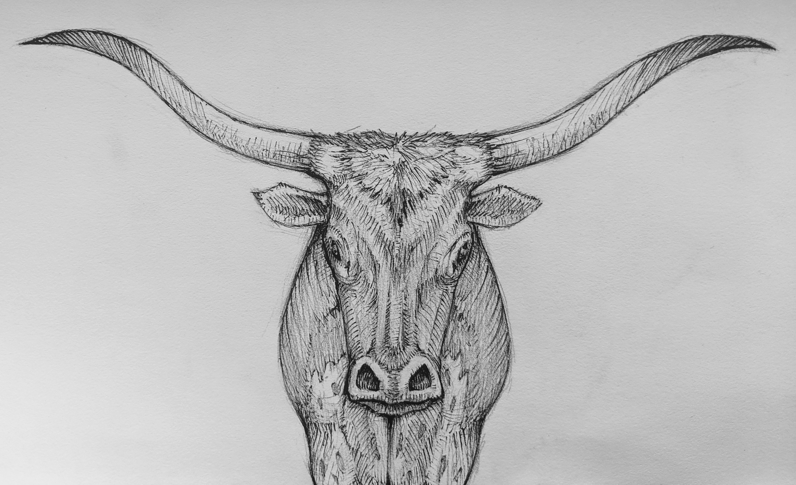

A break from my cat studies. Something more herbivorous. A bull with some nice big horns. Drawn with mechanical pencil and micropen.

> Cattle are large quadrupedal ungulate mammals with cloven hooves. Most breeds have horns, which can be as large as the Texas Longhorn or small like a scur.
> Careful genetic selection has allowed polled (hornless) cattle to become widespread.
