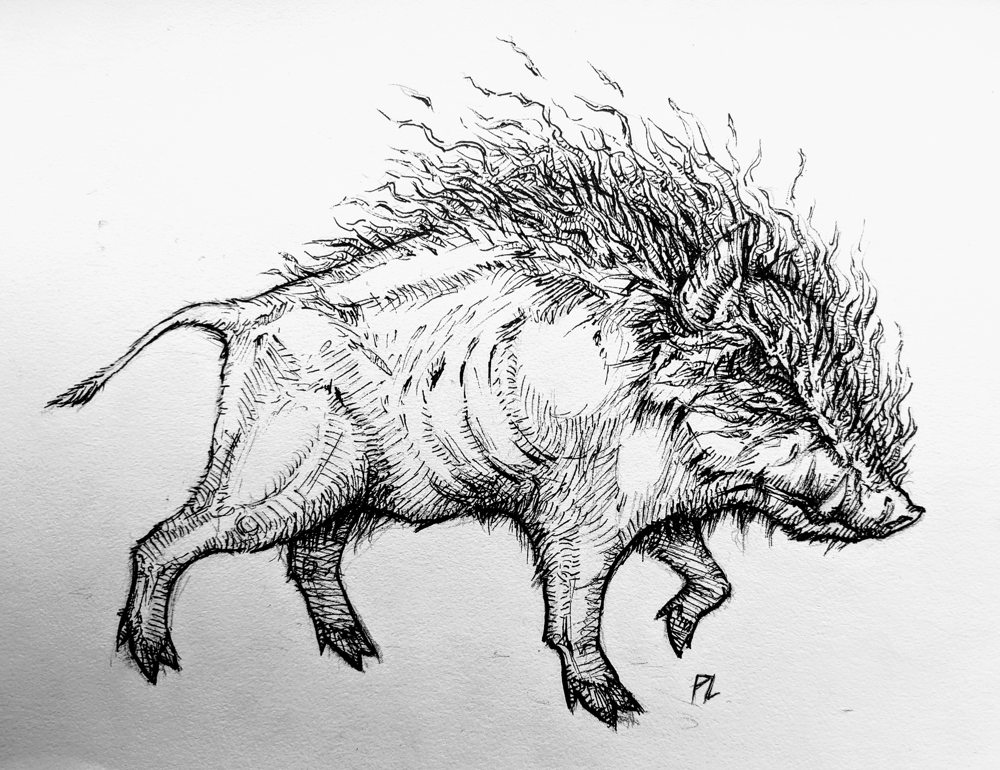

An old boar god corrupted... inspired by [Princess Mononoke](https://en.wikipedia.org/wiki/Princess_Mononoke) a long time Ghibli favorite of mine. Drawn with mechanical pencil and micropen.

> The boar clan is annihilated in battle, and Okkoto is corrupted by his wounds. Jigo's men disguise themselves in boar skins and trick the
> rampaging Okkoto into leading them to the Forest Spirit. San tries to stop Okkoto, but is swept up in his demonic corruption.
