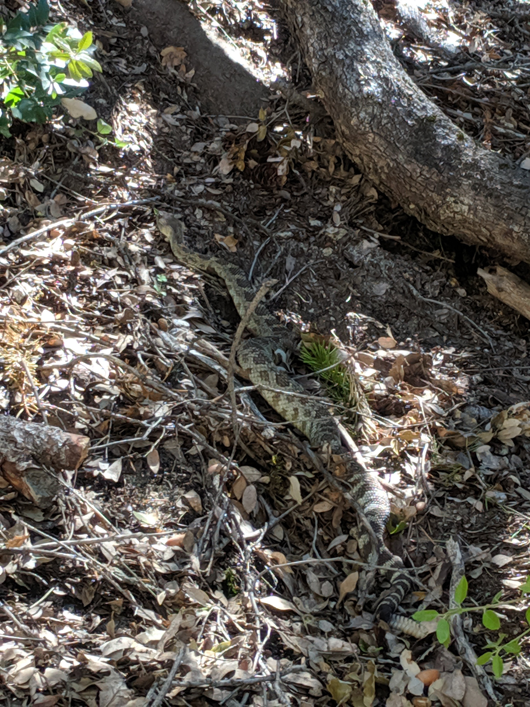

A rattlesnake siting in Yosemite this past week deserved a rattlesnake drawing. The [Crotalus oreganus](https://en.wikipedia.org/wiki/Crotalus_oreganus) commonly known as the Pacific rattlesnake popped up on our descent of the 4 Mile Trail. Drawn with mechanical pencil and micropen.

;

> Common names: western rattlesnake, northern Pacific rattlesnake, Pacific rattlesnake, more
> Crotalus oreganus is a venomous pit viper species found in North America in the western United States, parts of British Columbia, and
> northwestern Mexico.
