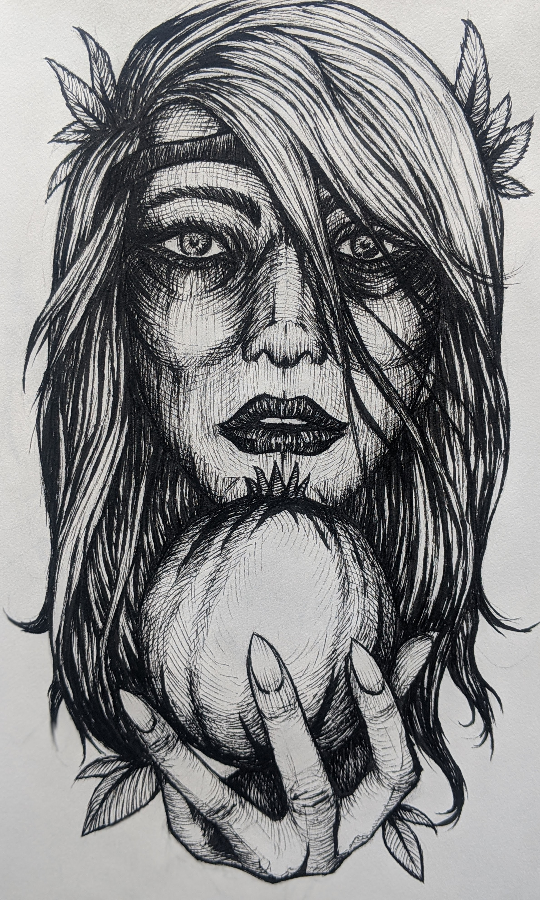

First attempt to mix in my new Pentel brush pen into my ink work.

[Persphone](https://en.wikipedia.org/wiki/Persephone)

> The myth of her abduction represents her function as the personification of vegetation, which shoots forth in spring and withdraws into the earth after harvest; hence, she is also associated with spring as well as the fertility of vegetation.

> Hades complies with the request, but first he tricks her (Persphone), giving her some pomegranate seeds to eat.
> Hermes, is sent to retrieve her, but because she had tasted the food of the underworld, she was obliged to spend a third of each year (the winter months) there, and the remaining part of the year with the gods above.
